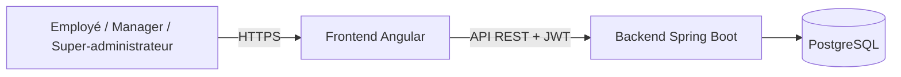

# Daily Reporting

Application web de suivi des activités quotidiennes d'ITC Innovation. Les employés rédigent leurs reportings, tandis que les Managers et le super-administrateur suivent l'activité de leur équipe depuis un espace dédié.

[Voir le dépôt GitHub](https://github.com/pakoundiconstantinoweb-commits/daily-reporting)

> Ce dépôt regroupe le frontend Angular et l'API Spring Boot. Aucun secret ni donnée de production ne doit y être stocké.

## Fonctionnalités

- Authentification par email et mot de passe avec jeton JWT.
- Espaces dédiés aux employés, Managers et super-administrateur.
- Reportings quotidiens, brouillons modifiables et historique personnel.
- Consultation des reportings par employé et par date.
- Réactions aux reportings.
- Gestion des comptes employés et de leur statut.
- Invitations Manager à usage unique, valables 24 heures et révocables.
- Gestion du profil et changement du mot de passe.

## Architecture



## Technologies

| Composant | Technologies |
| --- | --- |
| Frontend | Angular 21, TypeScript, HTML, CSS |
| Backend | Java 21, Spring Boot 4, Spring Security |
| API | REST, validation Jakarta, JWT |
| Persistance | PostgreSQL, Spring Data JPA, Hibernate |
| Tests | Vitest, JUnit, Mockito |

## Structure du dépôt

```text
daily-reporting/
├── itc-innovation-backend/     # API Spring Boot et tests
├── itc-innovation-frontend/    # Application Angular et documentation
├── .gitignore
└── README.md
```

## Prérequis

- JDK 21
- Node.js 22.12 ou ultérieur dans la branche 22
- npm
- PostgreSQL avec une base de données `itc_innovation`

## Démarrage local

### 1. Backend

Démarre PostgreSQL et crée la base `itc_innovation`. Depuis PowerShell :

```powershell
cd itc-innovation-backend
.\start-local.ps1
```

Le script demande le mot de passe PostgreSQL local et un nouveau mot de passe pour le super-administrateur. Il ne les affiche pas et ne les enregistre pas dans le dépôt. L'adresse du super-administrateur peut être définie au préalable dans la variable `SUPER_ADMIN_EMAIL`.

L'API est disponible sur `http://localhost:8080`.

### 2. Frontend

Dans un autre terminal PowerShell :

```powershell
cd itc-innovation-frontend
npm ci
npm start
```

L'application est disponible sur `http://localhost:4200`. Le proxy de développement relaie les requêtes `/api` vers le backend local.

## Configuration

Le backend utilise des variables d'environnement pour sa configuration. En production, configure les secrets dans le gestionnaire de secrets de la plateforme d'hébergement. Ne les ajoute jamais à Git.

| Variable | Utilisation |
| --- | --- |
| `SPRING_DATASOURCE_URL` | URL JDBC PostgreSQL |
| `SPRING_DATASOURCE_USERNAME` | Utilisateur PostgreSQL |
| `SPRING_DATASOURCE_PASSWORD` ou `DB_PASSWORD` | Mot de passe PostgreSQL |
| `APP_JWT_SECRET` ou `JWT_SECRET` | Clé de signature JWT, requise au démarrage |
| `APP_CORS_ALLOWED_ORIGINS` | Origines autorisées pour le frontend, séparées par des virgules |
| `SUPER_ADMIN_EMAIL` | Adresse du super-administrateur provisionné au démarrage |
| `SUPER_ADMIN_PASSWORD` | Mot de passe initial du super-administrateur |
| `SUPER_ADMIN_FIRST_NAME` | Prénom initial, facultatif |
| `SUPER_ADMIN_LAST_NAME` | Nom initial, facultatif |
| `PORT` | Port HTTP ; certaines plateformes le définissent automatiquement |

Configure `SUPER_ADMIN_EMAIL` et `SUPER_ADMIN_PASSWORD` ensemble pour provisionner le compte. Le bootstrap crée le compte s'il n'existe pas et peut promouvoir un Manager existant. Il ne réinitialise pas le mot de passe d'un compte déjà super-administrateur à chaque démarrage.

## Tests et compilation

Frontend :

```powershell
cd itc-innovation-frontend
npm ci
npm run build
npm test -- --watch=false
```

Backend (PostgreSQL local requis pour les tests nécessitant la base) :

```powershell
cd itc-innovation-backend
.\mvnw.cmd test
```

## Sécurité

Ne commite jamais de mot de passe, clé JWT, jeton d'accès, fichier `.env` réel ou donnée personnelle de production. En cas d'exposition d'un secret, révoque-le et renouvelle-le immédiatement.

## Documentation complémentaire

- [Cahier des charges fonctionnel](itc-innovation-frontend/docs/cahier-des-charges.md)
- [Dépôt GitHub](https://github.com/pakoundiconstantinoweb-commits/daily-reporting)
