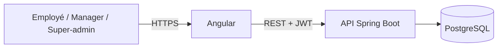

# Daily Reporting

Application interne de suivi des activités quotidiennes d'ITC Innovation. Les employés rédigent leurs reportings, tandis que les responsables suivent l'activité de leur équipe depuis un espace dédié.

> Dépôt monorepo : interface Angular et API Spring Boot. Les secrets et les données de production ne sont jamais stockés dans ce dépôt.

## Fonctionnalités

- Authentification par email et mot de passe avec jeton JWT.
- Espaces dédiés aux employés, Managers et super-administrateur.
- Reportings quotidiens, brouillons et historique personnel.
- Consultation par date et par employé ; réactions aux reportings.
- Gestion des comptes employés et de leur statut.
- Invitations Manager aléatoires, à usage unique, valables 24 heures et révocables.
- Profil et changement de mot de passe.

## Architecture



## Technologies

| Composant | Technologies |
| --- | --- |
| Frontend | Angular 21, TypeScript, HTML, CSS |
| Backend | Java 21, Spring Boot 4, Spring Security |
| API | REST, validation Jakarta, JWT |
| Persistance | PostgreSQL, Spring Data JPA, Hibernate |
| Tests | Vitest, JUnit, Mockito |

## Structure du dépôt

```text
daily-reporting/
├── .github/workflows/             # Vérifications CI
├── itc-innovation-backend/        # API Spring Boot et tests
├── itc-innovation-frontend/       # Application Angular et documentation
├── .gitignore
├── CONTRIBUTING.md
├── README.md
└── SECURITY.md
```

## Prérequis

- JDK 21
- Node.js 22.12 ou ultérieur dans la branche 22 (ou une version Angular 21 compatible)
- npm
- PostgreSQL et une base `itc_innovation`

## Démarrage local

### 1. API

Démarrer PostgreSQL et créer la base `itc_innovation`. Depuis PowerShell :

```powershell
cd itc-innovation-backend
.\start-local.ps1
```

Si `SUPER_ADMIN_EMAIL` n'est pas déjà défini, le script demande l'adresse du super-administrateur, puis demande les mots de passe PostgreSQL et super-administrateur. Les valeurs saisies ne sont pas écrites dans le dépôt.

L'API écoute sur `http://localhost:8080`.

### 2. Interface

Dans un autre terminal :

```powershell
cd itc-innovation-frontend
npm ci
npm start
```

L'application est disponible sur `http://localhost:4200`. Le proxy de développement relaie `/api` vers l'API locale.

## Configuration

Le backend lit les paramètres sensibles depuis les variables d'environnement. Les vrais secrets doivent être fournis par l'environnement d'exécution (par exemple, les variables du service de déploiement), jamais ajoutés à Git.

| Variable | Utilisation |
| --- | --- |
| `SPRING_DATASOURCE_URL` | URL JDBC PostgreSQL ; valeur locale par défaut dans `application.yaml` |
| `SPRING_DATASOURCE_USERNAME` | Utilisateur PostgreSQL |
| `SPRING_DATASOURCE_PASSWORD` ou `DB_PASSWORD` | Mot de passe PostgreSQL |
| `APP_JWT_SECRET` ou `JWT_SECRET` | Clé de signature JWT ; requise au démarrage |
| `APP_CORS_ALLOWED_ORIGINS` | Origines frontend autorisées, séparées par des virgules |
| `SUPER_ADMIN_EMAIL` | Adresse du super-administrateur provisionné au démarrage |
| `SUPER_ADMIN_PASSWORD` | Mot de passe initial du super-administrateur |
| `SUPER_ADMIN_FIRST_NAME` | Prénom initial, facultatif |
| `SUPER_ADMIN_LAST_NAME` | Nom initial, facultatif |
| `PORT` | Port HTTP ; fourni automatiquement par certaines plateformes |

Configure ensemble `SUPER_ADMIN_EMAIL` et `SUPER_ADMIN_PASSWORD`. Le bootstrap crée le compte s'il n'existe pas ; s'il existe déjà comme Manager, il le promeut en super-administrateur. Un compte déjà super-administrateur n'a pas son mot de passe réinitialisé à chaque redémarrage : un changement de variable seul ne remplace donc pas le mot de passe enregistré.

## Tests et compilation

Frontend :

```powershell
cd itc-innovation-frontend
npm ci
npm run build
npm test -- --watch=false
```

Backend (PostgreSQL local requis pour la suite complète) :

```powershell
cd itc-innovation-backend
.\mvnw.cmd test
```

Une intégration continue GitHub Actions exécute les tests frontend et backend sur les pull requests et les pushs vers `main`.

## Sécurité

Ne commitez jamais de mot de passe, clé JWT, jeton d'accès, fichier `.env` réel ou donnée personnelle de production. Consulte [SECURITY.md](SECURITY.md) pour signaler un problème de sécurité et [CONTRIBUTING.md](CONTRIBUTING.md) pour les règles de contribution.

## Documentation complémentaire

- [Cahier des charges fonctionnel](itc-innovation-frontend/docs/cahier-des-charges.md)
- [Guide de contribution](CONTRIBUTING.md)
- [Signalement de vulnérabilité](SECURITY.md)
- [Dépôt GitHub personnel](https://github.com/pakoundiconstantinoweb-commits/daily-reporting)
